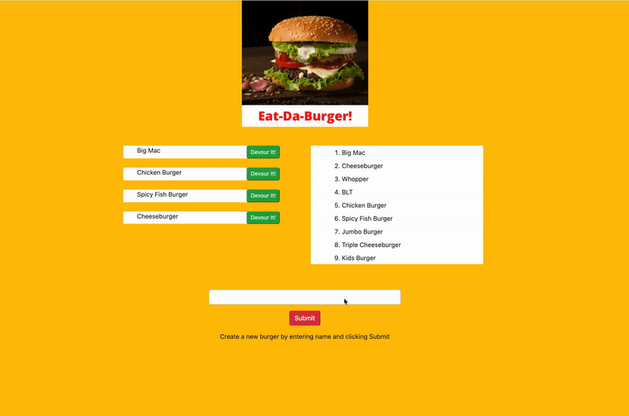

# Burger

# Overview

Restuarant application which allows customers to add new burgers and devour them!

**Functionality**
* Add a new burger to the database
* Update a burger status via button click
* Renders a list for each status only allowing customers to devour uneaten burgers
* Stores all data within a MYSQL database

# Example

# Contact

All queries relating to this repo should sent to [rob.sonter@newstartdigital.com.au](mailto:rob.sonter@newstartdigital.com.au)

